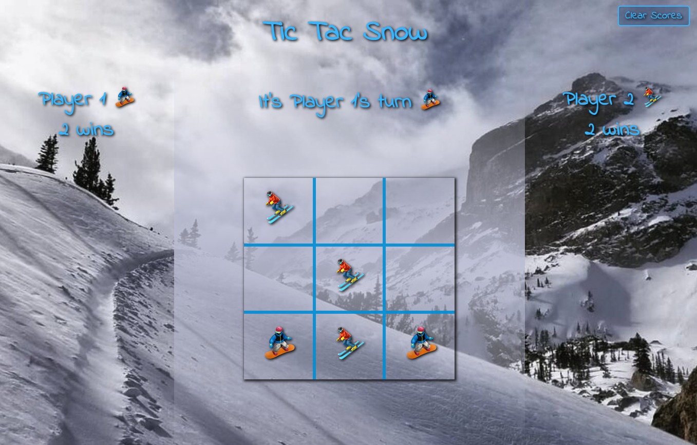

# Tic Tac Toe Mod 1 Final Project

### `Abstract:`
Now that you’ve got the main foundations down to build out a frontend application, it’s time to prove to yourself that you own those skills! You’re going to be building a Tic Tac Toe game from scratch!

### `Installation Instructions:`
1. [Click To Open Repo](https://github.com/RickV85/Tic_Tac_Toe_Mod_1_Final_Project)
2. Click the "Fork" button. (This will create a user copy of the repository.)
3. Open the Terminal application.
4. In Terminal, use the "cd" command to navigate to where the local repository will live.
5. In GitHub, click on the green "Code" dropdown.
6. User will see three clone options. Select "SSH".
7. Copy the SSH key.
8. In Terminal, run "git clone [insert copied SSH key here]".
9. In Terminal, use the "cd" command to navigate into the newly created directory.
10. Open the local repository by typing:
    * Atom - atom .
    * VS Code - code .

### `Preview of App:`

### `Context:`
This project was required to be built ground up in seven days with five required files. The main.js file contains functions only for manipulating the DOM. The game.js and player.js files create and handle all data model updates with their methods. The index.html and styles.css render content and style the DOM.

### `Contributors:`
Rick Vermeil
    * [GitHub](https://github.com/RickV85)
    * [LinkedIn](https://www.linkedin.com/in/rick-vermeil-b93581159/)

### `Learning Goals:`
1. Solidify and demonstrate your understanding of DRY JavaScript and event delegation to handle similar event listeners.
2. Understand the difference between the data model and how the data is displayed on the DOM
3. Iterate through/filter DOM elements using for loops
4. Use your problem solving process to break down large problems, solve things step by step, and trust yourself to not rely on an outside “answer” to a logical challenge

### `Technology Used:`
The HTML, CSS, and JavaScript for this application was written in VS Code and pushed into GitHub. 

### `Wins`

### `Future Additions`
